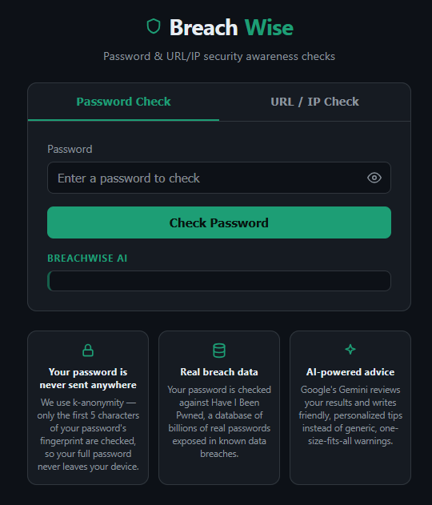

# BreachWise

A security awareness tool for checking passwords and URLs/IPs — with plain-English AI explanations instead of raw threat data.

BreachWise is a small security awareness web app with two tools: a password checker and a URL/IP reputation checker. The password checker cross-references Have I Been Pwned's breach database and scores strength locally, then uses Gemini to explain the results and suggest fixes in plain language. The URL/IP checker pulls reputation data from VirusTotal and AbuseIPDB and returns a Clean/Suspicious/Malicious verdict, again summarized by AI. It's built with FastAPI on the backend and plain HTML/CSS/JS on the frontend — no frameworks, no build step.

## Features

- **Password breach check** via Have I Been Pwned, using k-anonymity so your full password is never sent over the network
- **Local password strength scoring** (length, uppercase, lowercase, numbers, special characters) with specific weaknesses called out
- **AI-generated password analysis** — friendly, personalized advice powered by Gemini
- **Enhance My Password** — AI-generated stronger variations of your existing password
- **URL/IP reputation check** via VirusTotal and AbuseIPDB
- **Clean / Suspicious / Malicious verdict** with color-coded results
- **AI-generated URL/IP analysis** explaining the results in plain English
- **Dark-themed, responsive UI** — single HTML file, no build step, no JS frameworks
- **Robust error handling** — every route returns valid JSON with proper HTTP status codes, even when an external API fails

## Screenshot



## Setup

1. **Clone the repository**
   ```bash
   git clone https://github.com/<your-username>/breachwise.git
   cd breachwise
   ```

2. **(Optional) create a virtual environment**
   ```bash
   python -m venv .venv
   source .venv/bin/activate   # Windows: .venv\Scripts\activate
   ```

3. **Install dependencies**
   ```bash
   pip install -r requirements.txt
   ```

4. **Configure environment variables**
   ```bash
   cp .env.example .env
   ```
   Then fill in your API keys in `.env`:
   - `GEMINI_API_KEY`
   - `VIRUSTOTAL_API_KEY`
   - `ABUSEIPDB_API_KEY`

5. **Run the app**
   ```bash
   uvicorn main:app --reload
   ```

6. Open [http://localhost:8000](http://localhost:8000)

## APIs used

| API | Purpose | Docs |
|---|---|---|
| Have I Been Pwned (Pwned Passwords) | Breach lookups via k-anonymity, no API key required | [haveibeenpwned.com/API/v3#PwnedPasswords](https://haveibeenpwned.com/API/v3#PwnedPasswords) |
| VirusTotal API v3 | URL and IP reputation data | [docs.virustotal.com](https://docs.virustotal.com/reference/overview) |
| AbuseIPDB API | IP abuse confidence scoring | [docs.abuseipdb.com](https://docs.abuseipdb.com/) |
| Google Gemini API | AI-generated, plain-English analysis | [ai.google.dev/gemini-api/docs](https://ai.google.dev/gemini-api/docs) |
